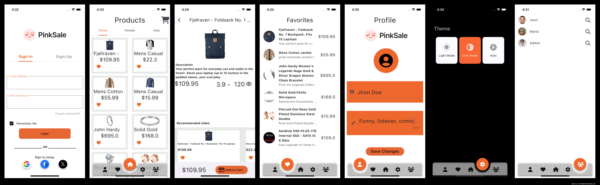

# ExampleApplication2024

Flutter project.

## Getting Started

A Flutter starter ecommerce app built with BLOC pattern. It has following features

  - Different animations across different part of screen 
  - Runs on both Android & IOS.
  - It helps in managing state and make access to data from a central place in your project.
  - Its a state management system for Flutter recommended by Google developers.

  ### Dependencies

This project is built with various awesome open sourced libraries

* [flutter_bloc](https://pub.dev/packages/flutter_bloc) - to mantain state and make every widget 
independent using blocs 

* [shared_preferences](https://pub.dev/packages/shared_preferences) - Perfect for storing data

* [dio](https://pub.dev/packages/dio) - Perfect for api requests

## Görseller

Uygulamanın Ekranları.

